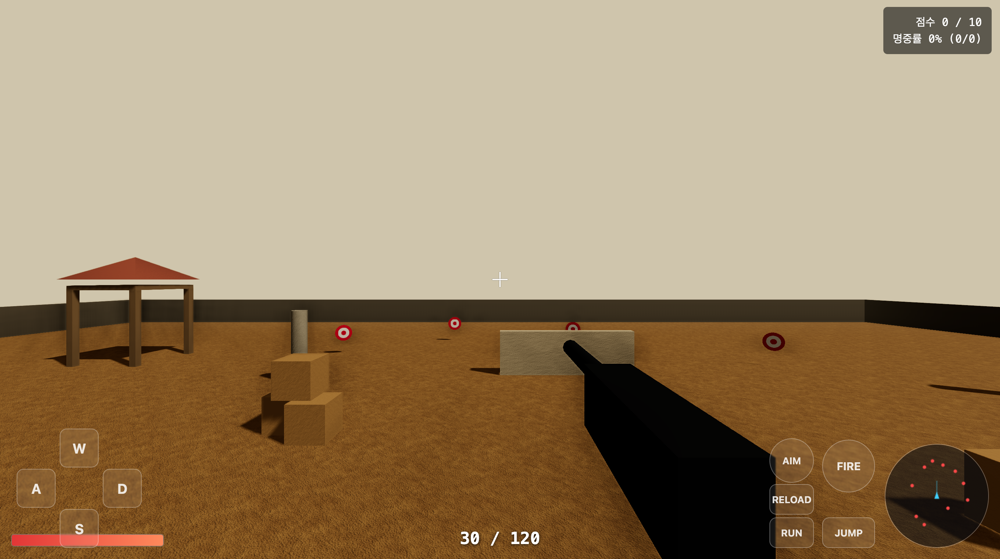
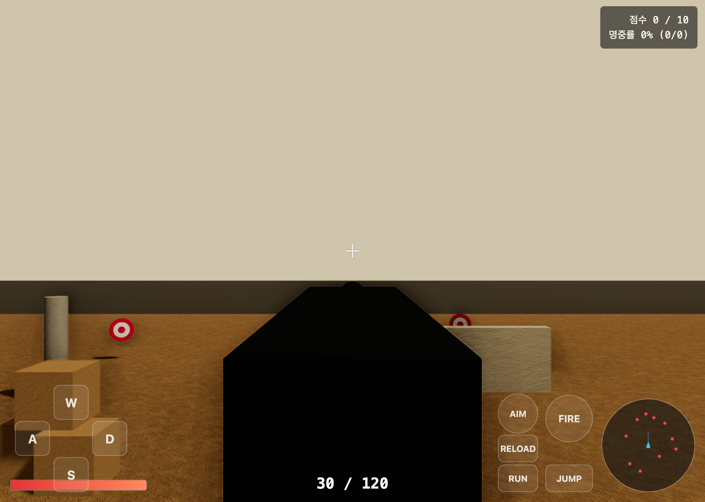

# FPS Game

| 평상시 | 조준 |
|:------:|:----:|
|  |  |

브라우저용 1인칭 슈팅(FPS) 게임. PUBG 미라마 스타일의 **사막 군사기지 사격장**에서 타겟을 맞히는 미니 게임입니다. Three.js로 충돌·무기·후처리까지 직접 구현했습니다.

  

## 기술 스택

- **Three.js** (r160+) · **Vite** · Vanilla JavaScript (ES Modules)
- 충돌: **Raycaster + AABB** 직접 구현 (물리엔진 미사용)
- 도형 기반 프리미티브 + **절차적 PBR 텍스처**(캔버스 생성, 외부 에셋 없음)

## 주요 기능

- 🎮 **1인칭 이동** — WASD, 달리기, 점프, 중력·지면/장애물 충돌, 상자 위 착지
- 🔫 **무기** — 발사(Raycaster), 반동, 머즐 플래시, WebAudio 합성 발사음
- 🎯 **사격 타겟** — 원판 10개(일부 좌우 왕복), 명중 이펙트, 점수·명중률(%), CLEAR/리스폰
- 🧰 **전투 UI** — 탄약(30/120), 재장전, 우클릭 ADS(FOV 줌·산포 감소), 체력바, 미니맵
- 🏜️ **그래픽** — 모래 팔레트, 원거리 안개, 부드러운 그림자, ACESFilmic 톤매핑, 후처리(Bloom/FXAA/SSAO)
- 🕹️ **조작** — 화면 드래그 시점 + 하단 온스크린 버튼(키보드 병행)

## 조작법

| 입력 | 동작 |
|------|------|
| 화면 **드래그** | 시점 회전 |
| **W / A / S / D** | 이동 |
| **Shift** | 달리기 |
| **Space** | 점프 |
| **Enter** | 발사 (누르면 연사) |
| **R** | 조준 (ADS, 누르는 동안) |
| 하단 **RELOAD 버튼** | 재장전 / 전멸 시 리스폰 |

> 하단의 투명 버튼(W/A/S/D·RUN·JUMP·FIRE·AIM·RELOAD)으로도 동일하게 조작할 수 있습니다.

## 실행

```bash
npm install
npm run dev        # http://localhost:5173
```

빌드 / 미리보기:

```bash
npm run build
npm run preview
```

## 프로젝트 구조

```
fps-game/
├── index.html          # 캔버스 + HUD/조작 버튼 마크업·스타일
└── src/
    ├── main.js         # 부트스트랩 · 게임 루프 · 입력 배선
    ├── config.js       # 모든 수치 단일 출처(CONFIG)
    ├── player.js       # 이동 · 카메라 · 상태머신 · AABB 충돌
    ├── weapon.js       # 발사 · 반동 · 탄약/재장전 · ADS · 합성음
    ├── enemies.js      # 타겟 생성/이동/명중/리스폰
    ├── world.js        # 맵 · 장애물 · 조명 · 안개
    ├── textures.js     # 절차적 PBR 텍스처(albedo/normal/roughness)
    ├── post.js         # EffectComposer(Bloom/FXAA/SSAO)
    ├── minimap.js      # 2D 미니맵
    ├── ui.js           # 점수/명중률/탄약/체력 HUD
    └── controls.js     # 드래그-룩 + 온스크린 버튼
```

## 설정 (CONFIG)

게임의 모든 수치는 `src/config.js`의 `CONFIG` 한 곳에서 관리합니다. 이동속도·중력·점프력·fireRate·반동·데미지·탄약·재장전·FOV 등.

성능이 부족하면 `CONFIG.graphics`에서 무거운 효과를 단계적으로 끌 수 있습니다:

```js
graphics: {
  postprocessing: true,   // false → 후처리 일괄 off (가장 가벼움)
  ssao:   { enabled: true },   // 1순위로 끄기 (부하 큼)
  bloom:  { enabled: true },
  fxaa:   { enabled: true },
  shadow: { enabled: true, mapSize: 2048 },  // 1024 / 512로 낮추기
}
```

## 라이선스

개인 학습용 프로젝트.
